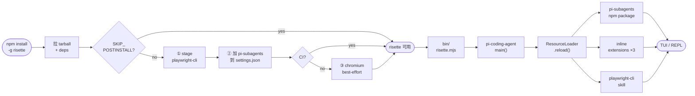
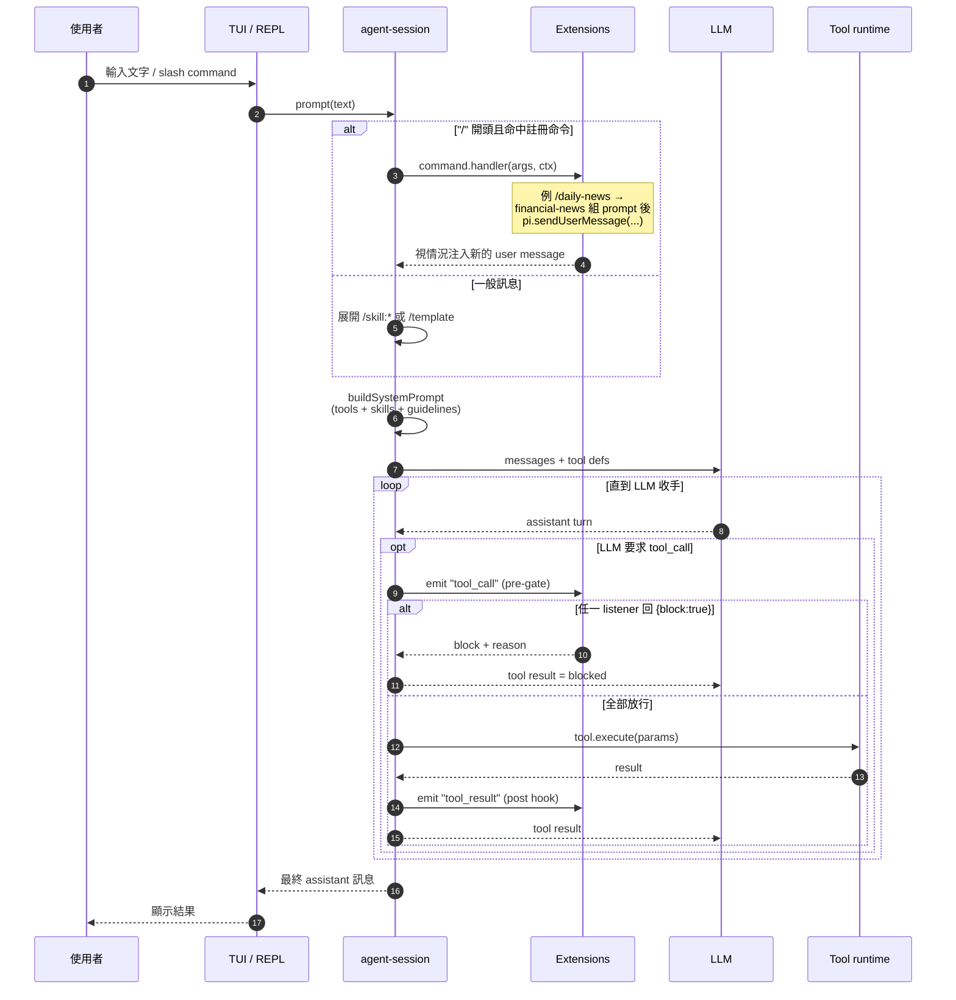
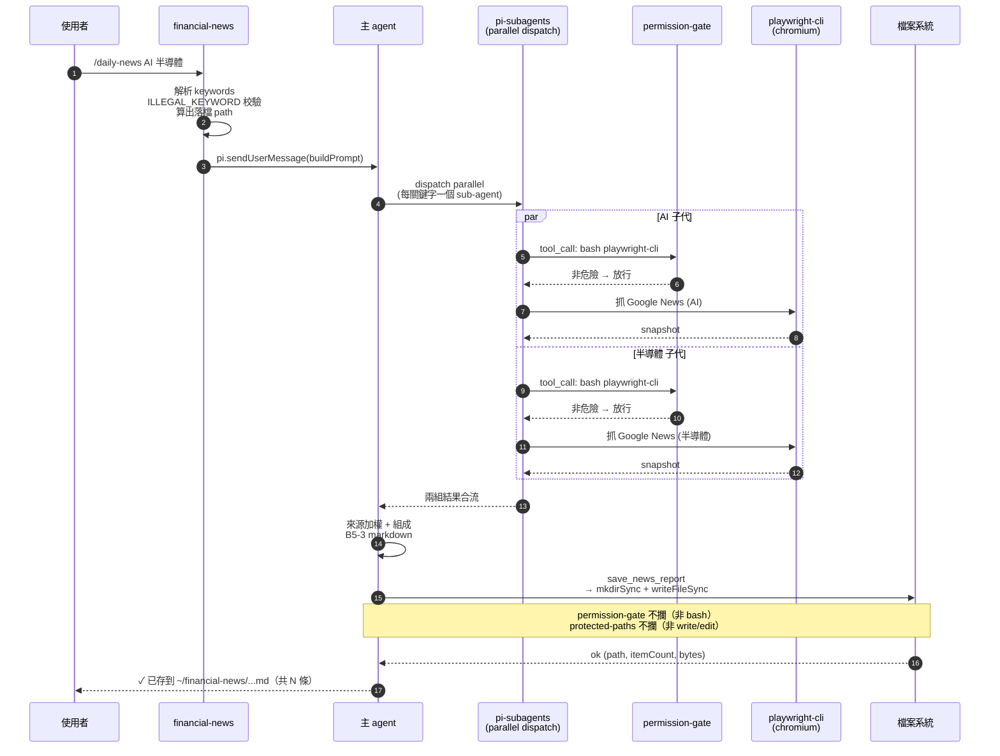

# Risette

Opinionated [pi-coding-agent](https://www.npmjs.com/package/@mariozechner/pi-coding-agent) CLI: financial news + safety extensions + playwright-cli skill, one install.

## 安裝

```bash
npm install -g risette@latest
risette
```

> **Windows 使用者：請避開 PowerShell 安裝**（cmd 或 WSL 皆可），並用**同一個 shell** 開啟 `risette` —— 用哪個裝就用哪個開。

安裝結束後，npm 會跑 Risette 的 `postinstall` script，在使用者 home 目錄做三件事：

1. **Stage `playwright-cli` skill** — 把 Risette 內附的 skill 目錄 copy 到 `~/.pi/agent/skills/`，pi 啟動時才掃得到。
2. **註冊 `npm:pi-subagents`** — 把這個 npm package 寫進 `~/.pi/agent/settings.json` 的 packages 列表，啟動時 pi 才會載入它（sub-agent 並行派發要用）。
3. **Best-effort 下載 chromium-headless-shell（~112MB）** — playwright 執行所需的瀏覽器 binary；下載失敗不擋安裝，之後可手動補。

不要這層自動化（CI、Docker build、想手動掌控 setup）：

```bash
RISETTE_SKIP_POSTINSTALL=1 npm install -g risette@latest
```

## 內含

### Extensions

- `permission-gate` — 攔截 bash 危險指令（`rm -rf` / `sudo` / `chmod 777` / `chown 777`）。
- `protected-paths` — 攔截 `write` / `edit` 寫到含 `.env` / `.git/` / `node_modules/` 的路徑。
- `financial-news` — 註冊 `/daily-news` command + `save_news_report` tool；agent 用 `playwright-cli` skill 抓 Google News 後落檔 `~/financial-news/YYYY-MM-DD[-<kw>...].md`。

`permission-gate` / `protected-paths` 取自 `@mariozechner/pi-coding-agent` 官方 examples（MIT）。

### Skills

- `playwright-cli/` — vendor 自微軟 [`@playwright/cli`](https://www.npmjs.com/package/@playwright/cli) 官方 `install --skills` 輸出。教 agent 用 `playwright-cli` 操作瀏覽器。

### Pi packages

- `npm:pi-subagents`（[nicobailon](https://github.com/nicobailon/pi-subagents)/MIT）— sub-agent 委派：single / parallel / chain + background runs + `/agents` 互動管理。Risette 在 postinstall 把它註冊進 `settings.json`，由 pi 標準 package loader 載入；之後跟著 `pi update` 升級。

## 運作流程

### 整體機制：install → 啟動

`npm install -g risette` 到使用者第一次能跑起 `risette`，中間經過兩段 lifecycle：



要點：

- postinstall 三步全 idempotent；CI 環境自動跳過 chromium 下載（~112MB）。
- `npm:pi-subagents` 真正載入發生在啟動期 `ResourceLoader.reload()`、不是 postinstall — 之後跟著 `pi update` 升級。
- Risette 三個 extension 走 inline `ExtensionFactory`（`package.json` 的 `pi.extensions` 指向 `./dist/extensions`）；npm package 與 inline factory 是兩條載入路徑，但最後共用同一份 `ExtensionAPI`。

### Agent 運行流程

使用者打字後 REPL → LLM → tool 的主路徑。Extension 在三個位置切進來：**command handler**（攔截 slash command）、**`tool_call` pre-gate**（permission-gate / protected-paths）、**`tool_result` post hook**。



兩條 safety gate 在 pre-execution 階段攔截：

| Extension | 攔截對象 | 觸發條件 | 動作 |
| --- | --- | --- | --- |
| `permission-gate` | `bash` tool | command 命中 `rm -rf` / `sudo` / `chmod 777` / `chown 777` | 互動模式彈確認；非互動模式直接 block |
| `protected-paths` | `write` / `edit` tool | path 含 `.env` / `.git/` / `node_modules/` | 直接 block + warning |

### 範例：`/daily-news AI 半導體`

把上面兩張圖具體化成一條真實路徑。多關鍵字情境下，主 agent 會用 `pi-subagents` 把每個關鍵字派成一個 sub-agent 平行抓取，再合流產出單一份日報：



幾個容易誤會的點：

- 主 agent 是否真的派 sub-agent，由 LLM 自己判斷；`pi-subagents`（postinstall 時註冊到 `settings.json` 的 npm package）只是在它的 toolbelt 裡。單關鍵字場景通常不會 dispatch、直接走 playwright。
- 每個 sub-agent 都是獨立 agent loop（自己的 system prompt 與 tool list），但**共用同一份 extension wiring** — 所以 `permission-gate` / `protected-paths` 對 sub-agent 的 tool call 一樣會 fire。
- `save_news_report` 是 financial-news extension 自己註冊的 tool，不會被任一條 gate 攔到（`permission-gate` 只看 `bash`、`protected-paths` 只看 `write` / `edit`），所以寫檔安全由 extension 自己負責 — `DATE_RE` + `ILLEGAL_KEYWORD` 兩道校驗在 `mkdirSync` / `writeFileSync` 之前。

## License

MIT — 見 `LICENSE`。
